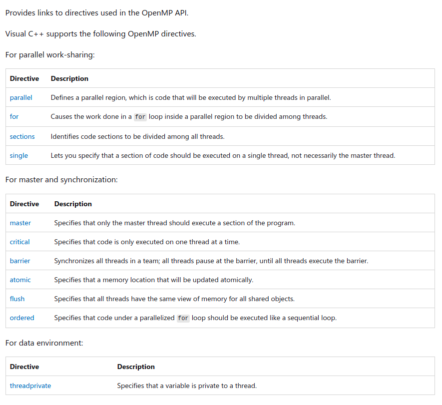

# Unit 4

# True and False Sharing

TODO

# Principles of Parallel Algorithm Design

## Granularity
- Granularity is task size (amount of computation)
- Depending on the number of tasks for the same problem size
    - Fine-grained decomposition - large number of tasks
    - Coarse grained decomposition - small number of tasks
- Granularity for dense matrix-vector product
    - fine-grain: each task represents an individual element in y
    - coarser-grain: each task computes 3 elements in y

## Degree of Concurrency

- The number of tasks that can be executed in parallel
- May change over program execution
- Metrics:
    - Maximum degree of concurrency
    =    - Maximum number of concurrent tasks at any point during execution
    - Average degree of concurrency
        - The average number of tasks that can be processed in parallel over the execution of the program
        - Speedup: serial_execution_time/parallel_execution_time
- Inverse relationship of DoC and task granularity

## Critical Path Length

- Critical Path - The longest weighted path throughout the graph
- Critical Path Length- Shortest time in which program can be executed in parallel

## Limits of Parallel Performance

- What bounds parallel execution time?
    - minimum task granularity
    - e.g. dense matrix-vector multiplication ≤ n2 concurrent tasks
    - fraction of application work that can’t be parallelized
- dependencies between tasks
- parallelization overheads
    - e.g., cost of communication between tasks
- Measures of parallel performance
    - speedup = T1/Tp – parallel efficiency = T1/(pTp)

# OPEN MP API

OpenMP (Open Multi-Processing) is an application programming interface (API) that supports multi-platform shared-memory multiprocessing programming in C, C++, and Fortran, on many platforms, instruction-set architectures and operating systems, including Solaris, AIX, FreeBSD, HP-UX, Linux, macOS, and Windows. It consists of a set of compiler directives, library routines, and environment variables that influence run-time behavior.

- Shared Memory Model
- Directive Based
- Easier to program & debug
- Supported by gcc4.2 & higher

- Open specifications for Multi Processing, based on a thread paradigm.
- Introduced in 1997 by OpenMP Architecture Review Board
    - v1.0-1997, v2.0-2005,v3.0-2008,v4.0-2013, v5.0 - Nov 2018.
    - V5.1 released in Nov 2020 with enhancements handling interactions with non-OpenMP device accelerators like CUDA streams, HIP or OpenCL
- 3 primary component (Compiler Directives, Runtime Library Routines, Environment Variables).
    - Extensions for Fortran, C, C++

OMP Programming Model
- Shared Memory, Thread Based Parallelism.
- Explicit Parallelism.
- Fork-Join Model
    - Execution starts with one thread – master thread.
    - Parallel regions fork off new threads on entry – team thread.
    - Thread join back together at the end of the region – only master thread continues.

OMP Programming Model :
OpenMP is a shared memory model.
- Workload is distributed between threads
- Variables can be
    - shared among all threads
    - duplicated for each thread
- Threads communicate by sharing variables
- Unintended sharing of data can lead to race conditions:
    - race condition: when the program’s outcome changes as the threads are scheduled differently.
- To control race conditions:
    - Use synchronization to protect data conflicts.
- Careless use of synchronization can lead to dead-locks

## OpenMP Directives (extra, not from syllabus)

Source: https://docs.microsoft.com/en-us/cpp/parallel/openmp/reference/openmp-directives?view=msvc-170



## Runtime Library
```cpp
int omp_get_num_threads(void);
// Returns the number of threads currently in the team executing the parallel region from which it is called

int omp_get_thread_num(void);
// Returns the thread number, within the team, that lies between 0 and omp_get_num_threads()- 1, inclusive.
// The master thread of the team is thread 0

void omp_set_num_threads(int);
// To set the number of threads
// Or modify the ENV varriable OMP_NUM_THREADS
```

## Boilerplate Code

```cpp
#include <stdio.h>
#include <omp.h>

int main() {
	int i, numt, id;
	#pragma omp parallel private (id) shared(numt)
	{
		numt = omp_get_num_threads();
		id = omp_get_thread_num();
		for (i=0; i<100; i++);
		
        printf("Output from thread %d of %d\n", id, numt);
	}
}
```

Building and running 
```bash
$ g++ -fopenmp src/main.c
$ ./a.out
Output from thread 0 of 12
Output from thread 6 of 12
Output from thread 8 of 12
Output from thread 9 of 12
Output from thread 3 of 12
Output from thread 1 of 12
Output from thread 2 of 12
Output from thread 11 of 12
Output from thread 7 of 12
Output from thread 4 of 12
Output from thread 10 of 12
Output from thread 5 of 12
```

Modifying default `OMP_NUM_THREADS`
```bash
$ OMP_NUM_THREADS=2 ./a.out # Modify the environment variable for the program
Output from thread 0 of 2
Output from thread 1 of 2
$ export OMP_NUM_THREADS=2 # OR change it globally
```

# Code Examples

# Example 0
```cpp
#include <stdio.h>
#include <omp.h>
int main()
{
    #pragma omp parallel
    {
        printf("Hello World... from thread = %d\n", omp_get_thread_num());
    }
}
```
## Output
```bash
$ OMP_NUM_THREADS=3 make target=ex0
Hello World... from thread = 0
Hello World... from thread = 1
Hello World... from thread = 2
```

# Example 1
```cpp
#include <stdio.h>
#include <omp.h>
int main()
{
    omp_set_num_threads(6); // Set number of threads
    #pragma omp parallel
    {
        printf("Hello World... from thread = %d\n", omp_get_thread_num());
    }
}
```
## Output
```bash
$ OMP_NUM_THREADS=3 make target=ex1 # Even though OMP_NUM_THREADS is set, the omp_set_num_threads overrides it
Hello World... from thread = 0
Hello World... from thread = 2
Hello World... from thread = 3
Hello World... from thread = 1
Hello World... from thread = 5
Hello World... from thread = 4
```

# Example 3
```cpp
#include <stdio.h>
#include <omp.h>
int main()
{
    int i, numt, id;
    #pragma omp parallel
    {
        numt = omp_get_num_threads();
        id = omp_get_thread_num();
        for (i=0;i<100;i++);
            printf(" Output from thread %d of %d\n",
        id, numt);
    }
}
```
## Output
```bash
$ OMP_NUM_THREADS=3 make target=ex3 # 2 of 3 appears twice, race condition
 Output from thread 2 of 3
 Output from thread 0 of 3
 Output from thread 2 of 3
```

# Example 3.1
```cpp
int main()
{
    int i, numt, id;
    #pragma omp parallel private (id) shared (numt) // Declare as private / shared
    {
        // ...
    }
}
```
## Output
```bash
$ OMP_NUM_THREADS=3 make target=ex3.1 # Consistently gives correct output, no race condition
 Output from thread 0 of 3
 Output from thread 1 of 3
 Output from thread 2 of 3
```

# Example 4 - For loops

Note that the following two are equivalent.

Source: https://stackoverflow.com/questions/1448318/omp-parallel-vs-omp-parallel-for

```cpp
#pragma omp parallel
{ 
    #pragma omp for
    for(int i = 1; i < 100; ++i)
    {
        ...
    }
}

#pragma omp parallel for
for(int i = 1; i < 100; ++i)
{
   ...
}
```

## Distributing for iterations over the available threads

Consider the following code example (ex4 from slides). Observing the code, we can infer the following:
- i runs from 0 to 2
- j runs from 0 to 4, i times
- `printf` will be called a total of 2*4 times, or 8 times
- Total of 8 'tasks' to be computed over `OMP_NUM_THREADS` number of threads
- To be precise, there are 2 serial tasks (`i`), which each have 4 sub-tasks (`j`) which can be run in parallel. Hence, the system can use a maximum of 4 threads
```cpp
#include <stdio.h>
#include <omp.h>
 
int main() {
    int i=0, j=0, id;
    #pragma omp parallel private (id,i,j)         
    {                                    
        for (i=0; i<2; i++) {  
            #pragma omp for        
            for (j=0; j<4; j++) {                
                id = omp_get_thread_num();
                printf("[Thread_%d] (i,j)=(%d,%d)\n", id, i,j);
            }
        }            
    }
}
```

## 4 Threads
This is the output with 4 threads
```bash
$ OMP_NUM_THREADS=4 make target=ex4
[Thread_0] (i,j)=(0,0)
[Thread_1] (i,j)=(0,1)
[Thread_3] (i,j)=(0,3)
[Thread_2] (i,j)=(0,2)
[Thread_0] (i,j)=(1,0)
[Thread_3] (i,j)=(1,3)
[Thread_2] (i,j)=(1,2)
[Thread_1] (i,j)=(1,1)
```

We see the following mapping:
- Thread_0 <= [ (0,0), (1,0) ]
- Thread_1 <= [ (0,1), (1,1) ]
- Thread_2 <= [ (0,2), (0,2) ]
- Thread_3 <= [ (0,3), (1,3) ]

## 2 Threads
This is the output with 2 threads
```bash
$ OMP_NUM_THREADS=2 make target=ex4
[Thread_0] (i,j)=(0,0)
[Thread_0] (i,j)=(0,1)
[Thread_1] (i,j)=(0,2)
[Thread_1] (i,j)=(0,3)
[Thread_0] (i,j)=(1,0)
[Thread_0] (i,j)=(1,1)
[Thread_1] (i,j)=(1,2)
[Thread_1] (i,j)=(1,3)
```

We see the following mapping:
- Thread_0 <= [ (0,0), (0,1), (1,0), (1,1) ]
- Thread_0 <= [ (0,2), (0,3), (1,2), (1,3) ]

## 8 Threads
This is the output with 8 threads
```bash
$ OMP_NUM_THREADS=8 make target=ex4
[Thread_0] (i,j)=(0,0)
[Thread_1] (i,j)=(0,1)
[Thread_3] (i,j)=(0,3)
[Thread_2] (i,j)=(0,2)
[Thread_0] (i,j)=(1,0)
[Thread_3] (i,j)=(1,3)
[Thread_2] (i,j)=(1,2)
[Thread_1] (i,j)=(1,1)
```

We see the following mapping:
- Thread_0 <= [ (0,0), (1,0) ]
- Thread_1 <= [ (0,1), (1,1) ]
- Thread_2 <= [ (0,2), (0,2) ]
- Thread_3 <= [ (0,3), (1,3) ]
- Thread_4 <= [  ]
- Thread_5 <= [  ]
- Thread_6 <= [  ]
- Thread_8 <= [  ]

Note that even though we provide 8 threads, only 4 threads are being utilised. This is because the 2 tasks bound to each `i` are made to run sequentially.

# Example 5
```cpp
#include <stdio.h>
#include <omp.h>
 
int main() {
    int i=0, j=0, id;
    #pragma omp parallel private (id,i,j)         
    {                          
        #pragma omp for                  
        for (i=0; i<4; i++) {  
            for (j=0; j<4; j++) {                
                id = omp_get_thread_num();
                printf("[Thread_%d] (i,j)=(%d,%d)\n", id, i,j);
            }
        }            
    }
}
```
## Output
```bash
$ OMP_NUM_THREADS=4 make target=ex5
[Thread_0] (i,j)=(0,0)
[Thread_0] (i,j)=(0,1)
[Thread_0] (i,j)=(0,2)
[Thread_0] (i,j)=(0,3)
[Thread_1] (i,j)=(1,0)
[Thread_1] (i,j)=(1,1)
[Thread_2] (i,j)=(2,0)
[Thread_2] (i,j)=(2,1)
[Thread_2] (i,j)=(2,2)
[Thread_2] (i,j)=(2,3)
[Thread_3] (i,j)=(3,0)
[Thread_3] (i,j)=(3,1)
[Thread_3] (i,j)=(3,2)
[Thread_3] (i,j)=(3,3)
[Thread_1] (i,j)=(1,2)
[Thread_1] (i,j)=(1,3)
```

We see the following mapping:
- Thread_0 <= [ (0,0), (0,1), (0,2), (0,3) ]
- Thread_1 <= [ (1,0), (1,1), (1,2), (1,3) ]
- Thread_2 <= [ (2,0), (2,1), (2,2), (2,3) ]
- Thread_3 <= [ (3,0), (3,1), (3,2), (3,3) ]

# 2D Array Access

```cpp
// Array is accessed rowwise. Gives good performance
// as elements of a row will sit in the same cache line.
for (int i=0; i<n; i++)
    for (int j=0; j<n; j++)
        sum += a[i][j];

// Array is accessed column-wise. Gives bad performance
// as elements of a column will sit in the different
// cache line, resulting a cache misses.
for (int j=0; j<n; j++)
    for (int i=0; i<n; i++)
        sum += a[i][j];
```

# Loop Interchange

Here, a nested loop access the array column-wise. In this case, interchange of loop will improve the cache accessibility.4
```cpp
for (int i=0; i<n; i++)
    for (int j=0;j<n; j++)
        b[j][i] = a[j][i];
// Changed to the following
for (int j=0; j<n; j++)
    for (int i=0; i<n; i++)
        b[j][i] = a[j][i];
```

# Loop Unrolling
```cpp
// Loop overheads are relatively high when each iteration.
// Has a small number of operations.
for (int i=0; i<n; i++) {
    a[i] = b[i] + 1;
    c[i] = a[i] + a[i-1] + b[i-1];
}

// Loop has been unrolled by a factor of 2 to reduce overheads.
// We assume the iterations is divisible by 2.
for (int i=0; i<n; i+=2) {
    a[i] = b[i] + 1;
    c[i] = a[i] + a[i-1] + b[i-1];
    a[i+1] = b[i+1] + 1;
    c[i+1] = a[i+1] + a[i] + b[i];
}
```
# Loop Fusion

```cpp
/* A pair of loop that both access array a.
The second loop reuses element a[i], but by
the time it is executed , the cache line this
element is part of, may no longer be in the
cache. */
for (int i=0; i<n; i++)
    a[i] = b[i] * 2;
for (int i=0; i<n; i++) {
    x[i] = x[i] * 2;
    c[i] = a[i] + 2;
}

/* A pair of loops have been combined and the
statements are reordered. This allows the
values of a to be immediately reused while
being available in the cache. */
for (int i=0; i<n; i++) {
    a[i] = b[i] * 2;
    x[i] = x[i] * 2;
    c[i] = a[i] + 2;
}
```

# Loop Fission
```cpp
/* Loop with poor cache utilization gives poor performance.
If we can split the updates to array c from rest of the work
Loop interchange can be applied to improve cache hit. */
for (int i=0; i<n; i++) {
    c[i] = exp(i/n);
    for (int j=0; j<n; j++)
        a[j[i]] = b[j][i] + d[j] * e[i];
}

// Changed to the following
for (int i=0; i<n; i++)
    c[i] = exp(i/n);
for (int i=0; i<n; i++)
    for (int j=0; j<n; j++)
        a[j[i]] = b[j][i] + d[j] * e[i];
```

# Loop Tiling
```cpp
/* Here, a nested loop does the array transpose.
In this case, Loop interchange will not improve
The use of cache or TLB. A fresh approach is required. */
for (int i=0; i<n; i++)
    for (int j=0; j<n; j++)
        b[i][j] = a[j][i];

/* How to reduce cache misses?
Here we have used tiling. Split the inner loop into a
pair of loops. The reduces cache misses. */
for (int j1=0; j1<n; j1+=nbj)
    for (int i=0; i<n; i++)
        for (int j2=0; j<MIN(n-j1,nbj); j2++)
            b[i][j1+j2] = a[j1+j2][i];
```

# OpemMP Shared and Private

## default(shared|none)

- Allows the user to specify the default scope for all of the variables in the parallel region.
- If this is not specified at the beginning of the parallel region, the default is automatically shared.
- Specific variables can be exempted from the default by using one of the other clauses.
```cpp
#pragma omp parallel default(private), shared(a,b)
```
- If you specify DEFAULT(NONE), you are required to declare each variable inside the parallel region explicitly.

## shared(list)

- Most variables are shared and these variables exist only in one memory location and all threads can read or write to that address.
- Generally read only variables are shared (they can not accidently be over written) and main arrays are shared.
```cpp
#pragma omp parallel default(none), shared(a,b)
```
- They are the only variables in this region because we specified DEFAULT(NONE) first which requires that all variables be explicitly defined.

## private(list)
- A variable that is private can only be read or written by its own thread.
- When a variable is declared as private, a new object of the same type is declared once for each thread and all references to the original object are replaced with references to the new object.
- By default, loop indices are private and loop temporaries are private.
```cpp
#pragma omp parallel default(none), shared(a,b), private(i,j)
```

# Race Condition

How to avoid numt being executed by all the threads, which is one time requirement?

```cpp
#include <stdio.h>
#include <omp.h>
int main()
{
    int i, numt, id;
    #pragma omp parallel private(id) shared(numt)
    {
        id = omp_get_thread_num();
        if (id==0)
            numt = omp_get_num_threads();
        for (i=0;i<100;i++);
            printf(" Race condition from thread %d of %d\n\n", id, numt);
    }
}
```
Output:
```bash
$ make target=race_par2
Race condition from thread 1 of 0
Race condition from thread 0 of 4
Race condition from thread 2 of 0
Race condition from thread 3 of 4
```